# RGEVS
- [x] The Project is made for Windows only.

#### SOURCE CODE CANNOT BE PROVIDED AS THIS SOFTWARE IS STILL IN USE IN SCHOOLS
-----------------------------------------------------------------------------

For last 15 years, my school, Ryan Int'l Ghaziabad, was using a ballot box based voting system, so my Computer Science faculty asked me for a solution. Hence I made the first ever electronic voting system for my school. 

The CUI version was used continuously for 2 years and later on another branch of the school showed their interest in the software.

-----------------------------------------------------------------------------

## 32 bit version is actually 16 bit
Actually it is not 32 bit, this version was compiled on Turbo C++, which is a 16 bit compiler.
But this runs on Windows 32 in compatibility mode. For 64 bit, use the 64 bit compiled version. 

But many users get confused with 32 and 16 bit thing, so I refer it as 32 bit version, everywhere in the manuals.

-----------------------------------------------------------------------------

## 64 bit version
This was compiled in Codeblocks, using minGW. The turbo code was ported and the 80 x 25 character size, old turbo like screen was made possible using windows APIs. Hence it does not runs in full screen. But a way to it is made possible, and a guide is provided for that.

-----------------------------------------------------------------------------

## Links to Facebook
#### [2019](https://www.facebook.com/vaibhav.gupta.1004837/posts/2302919146436153)
#### [2017](https://www.facebook.com/vaibhav.gupta.1004837/posts/1413303472064396) 
#### [2016](https://www.facebook.com/vaibhav.gupta.1004837/posts/1094078750653538) 

-----------------------------------------------------------------------------

## Glance at 2017
My School Principal, Mrs. Anju Sharma, Using the software.
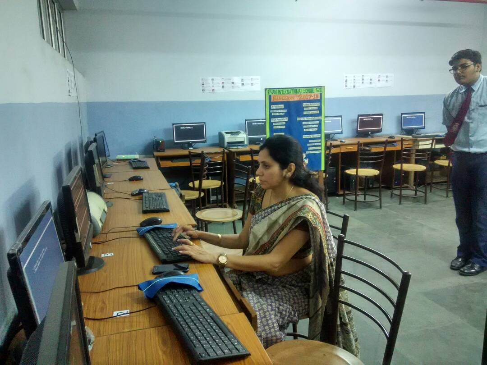

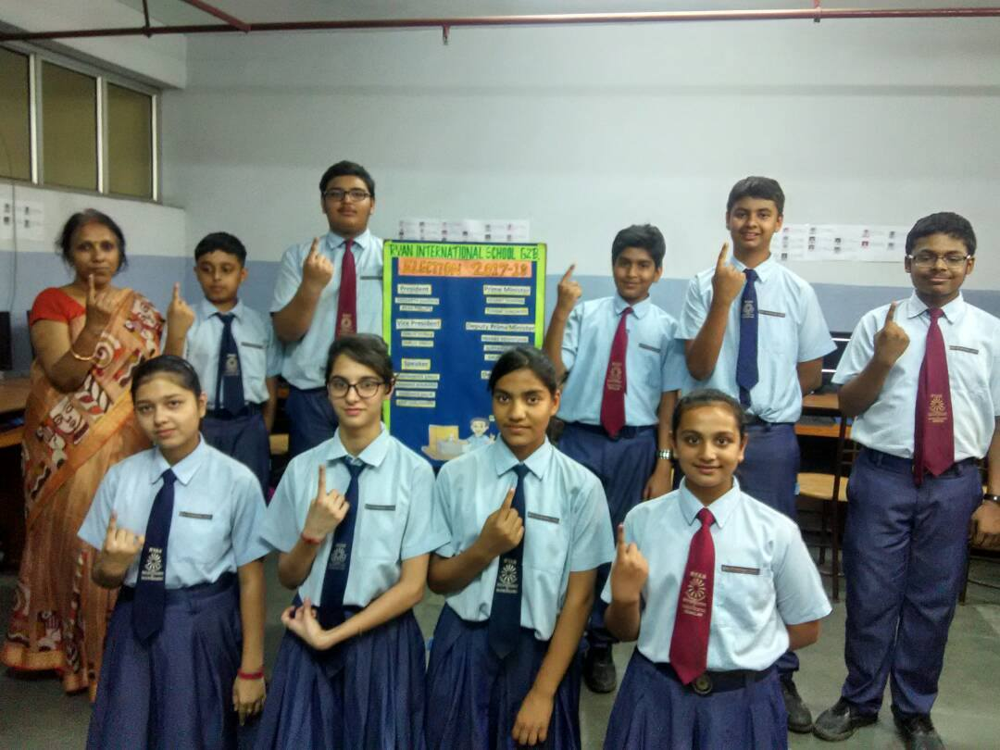

-----------------------------------------------------------------------------

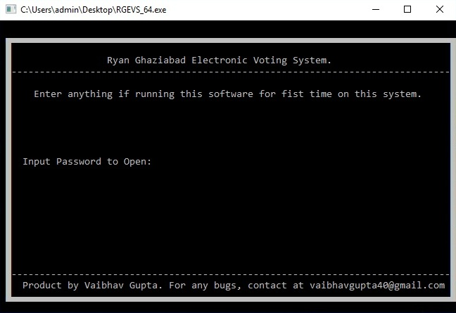
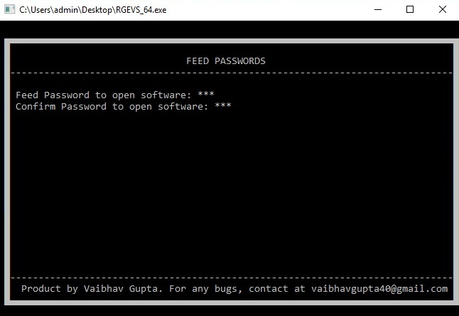
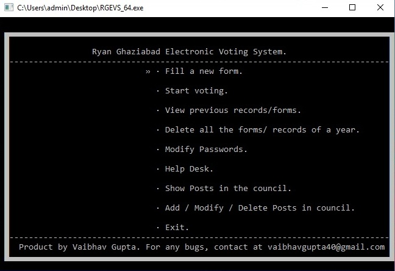
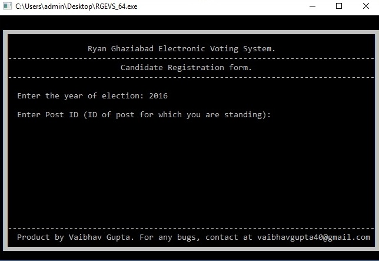
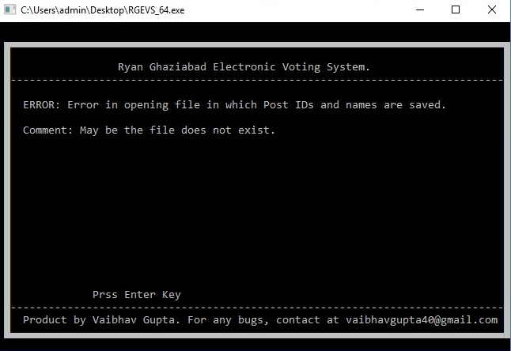
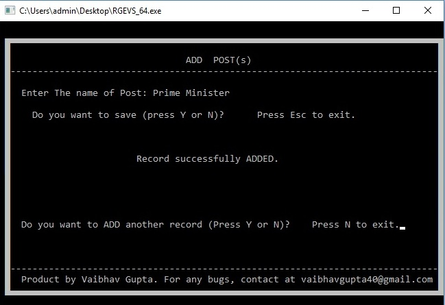
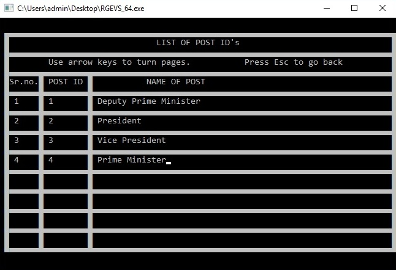
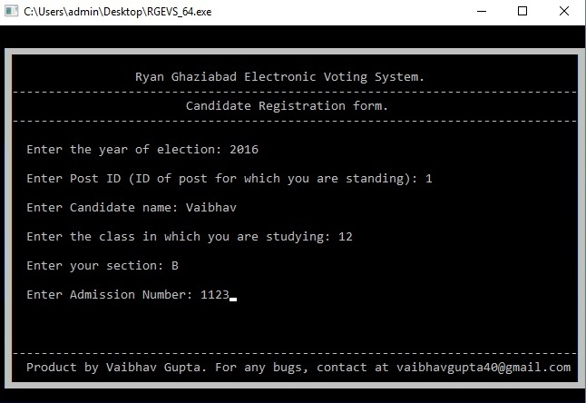
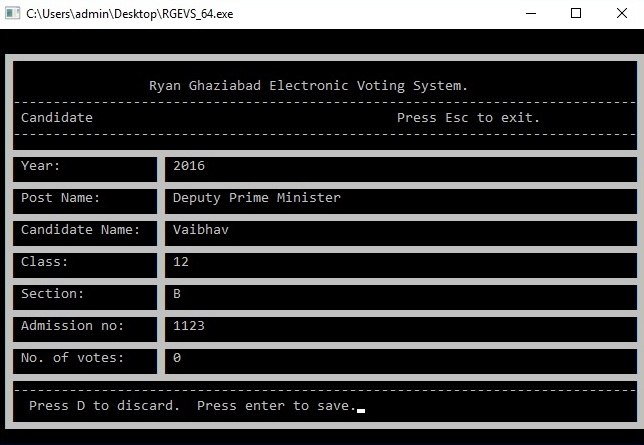
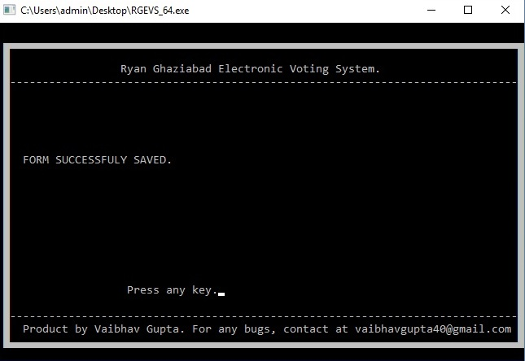
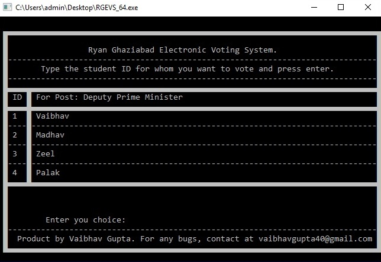
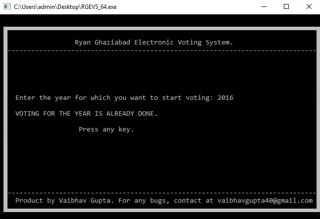
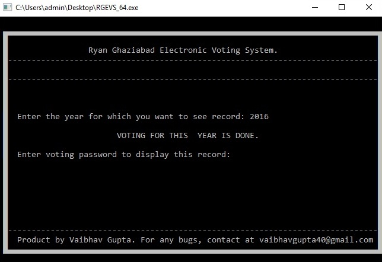
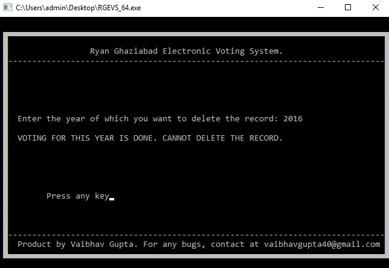
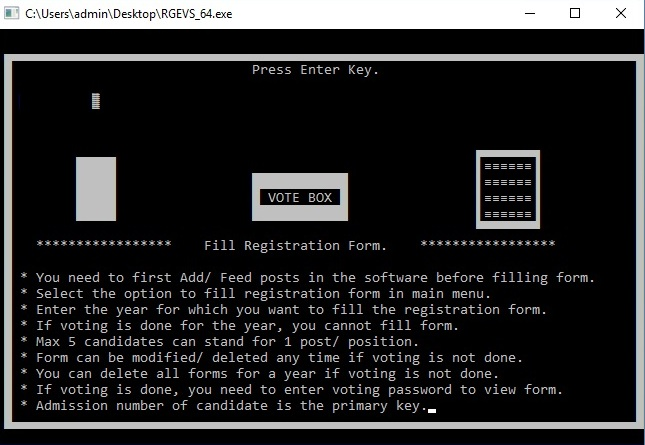

